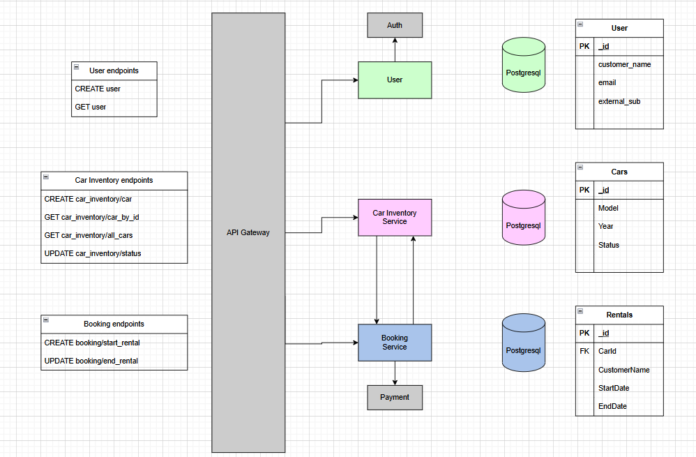

# DriveNow
Home exercise 5.1-8.1
## My System Architecture

  

The system is designed as a Microservices Architecture, that split to few services. 
This design prioritizes Separation of Concerns, Scalability, and Data Integrity.

- Booking Service - handles the business logic of renting cars, Validates and creates new rental reservations.
- Car Inventory service - manager of the cars stock. It is the only service authorized to modify cars data, responds to 
HTTP requests from the Booking Service to confirm if a specific car is currently available.
- API Gateway - Acts as the single entry point for all client requests. and load balancer
- User Service - handle the lifecycle of the user object  
- Auth & payment - additional services that can be integrated as future features to the car rental system. 
These are built-in services that require only configuration to be enabled, and they offer multiple options depending 
on the environment in which the system is deployed

### Why PostgreSQL?
PostgreSQL was selected as the relational database for this system for the following reasons:

- Structured Relational Data: The main objects (Cars and Rentals) are structured and have strict schema, 
making a relational database superior to a NoSQL DB.

- ACID Compliance: PostgreSQL provides robust ACID compliance. 
Transactions will be automic, leave the DB in a consistent state, not interfere with each other, and the DB will be durable.

- PostgreSQL is less suitable for horizontal scaling because it doesn't provide built-in sharding and replication features. 
As a result, these features must be managed manually if we'd like to introduce them, which increases operational complexity.
Although, if we choose not to introduce them, the database will only have one instance and will become less reliable.
Despite this, for now one instance of PostgreSQL (which can be vertically scaled) will satisfy our system requirements, 
as correctness is the most critical requirement in our system.

### Why use blocking Request-Response communication between booking and car inventory services?
Between the booking service and the car inventory service we require request-response communication because, 
when a user attempts to book a car, the system must **immediately** return a response indicating whether the operation succeeded or failed. 
message brokers are unidirectional communication that occur eventually and are therefore not suitable in this scenario
because it cannot return an immediate response, making it impossible to provide real time response to the user.