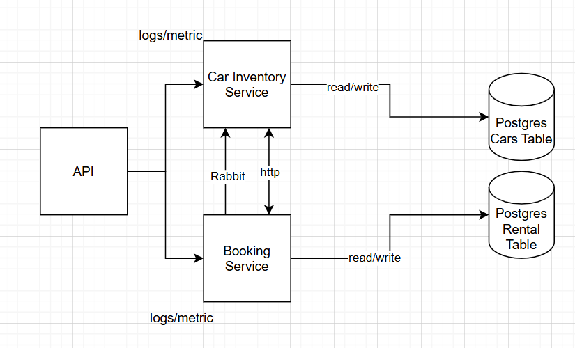

# DriveNow
Home exercise 5.1-8.1
## My System Architecture

  

The system is designed as a Microservices Architecture, that split to two services: Car Inventory Service and Booking Service. 
This design prioritizes Separation of Concerns, Scalability, and Data Integrity.

- Booking Service - handles the business logic of renting cars, Validates and creates new rental reservations.
- Car Inventory service - manager of the cars stock. It is the only service authorized to modify cars data, responds to 
HTTP requests from the Booking Service to confirm if a specific car is currently available. get messages from RabbitMQ, 
When a car is booked or returned, it automatically updates the car state.
- API - Acts as the single entry point for all client requests.

### Why PostgreSQL?
PostgreSQL was selected as the relational database for this system for the following reasons:

- Structured Relational Data: The main objects (Cars and Rentals) are structured and have strict schema, 
making a relational database superior to a NoSQL DB.

- ACID Compliance: PostgreSQL provides robust ACID compliance. This ensures that if a booking fails midway, 
the database rolls back completely, preventing corrupted "half-saved" records.

- Concurrency Control: PostgreSQL's MVCC excels at handling race conditions. 
It allows the Inventory Service to serve read requests (browsing cars) efficiently without being blocked by simultaneous 
write operations (new bookings) occurring in the Booking Service that allow multiple users in the same time.

### Why RabbitMQ?
By using RabbitMQ, the Booking Service saves the rental and immediately says "Success" to the user. 
The "Update Car Status" task is sent to the queue to be handled in the background.
This makes the application feel much faster and more responsive. in addition, if the Inventory Service goes offline,
the Booking Service can still accept bookings, and the system is continuing to work.